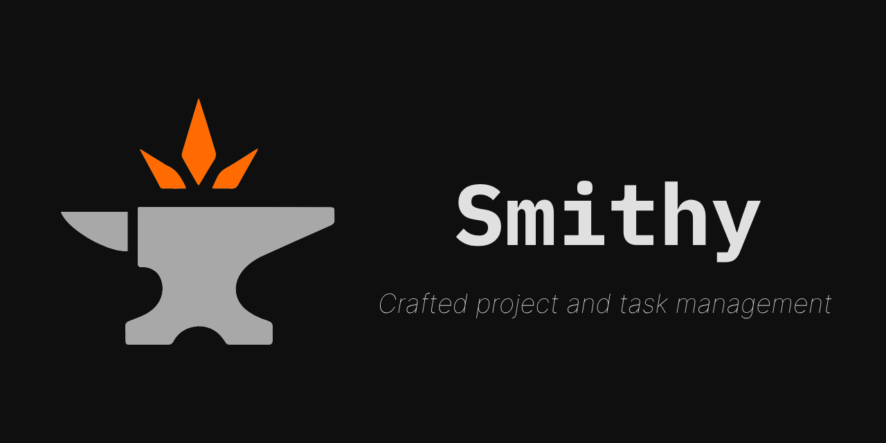

# Smithy



A modern, full-stack project and task management platform built for developers and teams.

[](https://opensource.org/licenses/MIT)
[](https://www.python.org/downloads/)
[](https://nodejs.org/)
[](https://fastapi.tiangolo.com)
[](https://nextjs.org/)
[](https://docs.astral.sh/ruff/)
[](https://github.com/Anvoria/smithy/actions/workflows/ci.yml)

---

## ✨ Features

- **🚀 Fast and Modern** - FastAPI backend + Next.js frontend for optimal performance
- **🔐 Secure by Default** - JWT authentication with MFA support (TOTP + backup codes)
- **👥 Multi-tenant** - Organizations with role-based access control
- **📊 Project Management** - Comprehensive project and task tracking
- **🌐 API-First** - RESTful API with auto-generated OpenAPI documentation
- **🔧 Developer-Friendly** - Built by developers, for developers

### Core Functionality

- User management (registration, login, profile)
- Project organization (create, update, delete projects)
- Task tracking (full CRUD with status, priority, due dates)

---

## 🚀 Getting Started

### Prerequisites

- **Docker & Docker Compose** (recommended)
- **Python 3.13+** (for local backend development)
- **Node.js 20+** (for local frontend development)
- **PostgreSQL 15+** (if not using Docker)

### Quick Start

```bash
# Clone the repository
git clone https://github.com/Anvoria/smithy.git
cd smithy

# Copy environment variables
cp backend/.env.example backend/.env

# Start the full stack
docker-compose up --build

# The application will be available at:
# - Backend API: http://localhost:8000
# - API Documentation: http://localhost:8000/docs
```

### Local Development Setup

#### Backend Setup

```bash
cd backend

# Create virtual environment
python -m venv venv
source venv/bin/activate  # On Windows: venv\Scripts\activate

# Install dependencies
pip install -r requirements.txt

# Set up environment
cp .env.example .env

# Run database migrations
alembic upgrade head

# Start development server
uvicorn app.main:app --reload --host 0.0.0.0 --port 8000
```

#### Frontend Setup

```bash
cd frontend

# Install dependencies
pnpm install

# Start development server
pnpm run dev
```

---

## 🧪 Testing

Coming soon!

---

## 🤝 Contributing

We welcome contributions! Please see our [Contributing Guide](CONTRIBUTING.md) for details on:

- Setting up the development environment
- Code style and formatting guidelines
- Submitting pull requests
- Reporting issues

---

## 📋 Roadmap

### 🧱 Foundation

- [x] Project scaffold (folder structure, FastAPI app)
- [x] Environment setup (.env, config loader)
- [x] Base Dockerfile + docker-compose
- [ ] SQLAlchemy models (User, Project, Task)
- [x] Alembic migrations
- [x] JWT authentication (access and refresh)
- [ ] Initial tests (pytest + coverage)
- [x] Basic logging + error handling

### 📡 API Layer

- [x] Auth endpoints (register, login, refresh)
- [x] User CRUD
- [ ] Project CRUD
- [ ] Task CRUD
- [ ] Filtering & pagination
- [x] Basic OpenAPI docs

### 📦 Later / Feature Plans

- [ ] Web dashboard (Next.js frontend)
- [ ] Team collaboration (invites, roles)
- [ ] Time tracking
- [ ] Webhooks
- [ ] Notifications

---

## 📄 License

This project is licensed under the MIT License - see the [LICENSE](LICENSE) file for details.